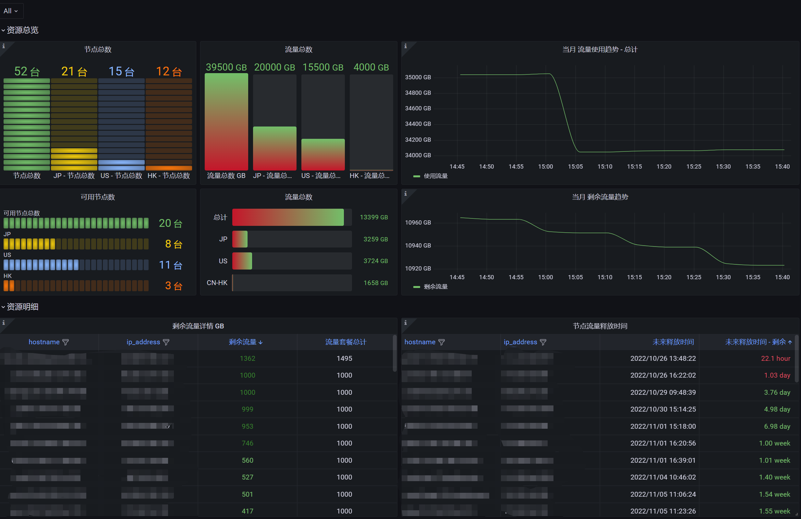

# vollcloud-exporter
[vollcloud](https://vollcloud.com/) 云资源监控 vollcloud-exporter 使用 golang 提供高性能 metrics API

Mertrics api 采集 vollcloud 服务器信息. [mertrics 数据案例](./docs/mertrics_example)

[Language English](README.md)

## 使用说明
安装
```shell
version=v1.2
wget https://github.com/weiqiang333/vollcloud-exporter/releases/download/${version}/vollcloud-exporter-linux-amd64-${version}.tar.gz
mkdir /usr/local/vollcloud-exporter
tar -zxf vollcloud-exporter-linux-amd64-${version}.tar.gz -C /usr/local/vollcloud-exporter
chmod +x /usr/local/vollcloud-exporter/vollcloud-exporter
/usr/local/vollcloud-exporter/vollcloud-exporter --config.file /usr/local/vollcloud-exporter/config/vollcloud-exporter.yaml
    # Don't forget to modify your config file /usr/local/vollcloud-exporter/config/vollcloud-exporter.yaml
```

vollcloud-exporter 命令可用参数
```
      --address string      The address on which to expose the web interface and generated Prometheus metrics. (default ":9109")
      --configfile string   exporter config file (default "./config/vollcloud-exporter.yaml")
```

### 使用 systemd 管理服务
```
cp /usr/local/vollcloud-exporter/config/vollcloud-exporter.service /etc/systemd/system/
systemctl daemon-reload
systemctl enable --now vollcloud-exporter
systemctl status vollcloud-exporter
```

### API
```
    http://127.0.0.1:9109/metrics
    http://127.0.0.1:9109/reload  # 重新加载默认配置文件 "config/config.yaml"
```

---
## prometheus
- 配置 prometheus.yml
```yaml
scrape_configs:
    - job_name: vollcloud_cloud
      honor_timestamps: true
      scrape_interval: 15m
      scrape_timeout: 1m
      metrics_path: /metrics
      scheme: http
      follow_redirects: true
      enable_http2: true
      static_configs:
      - targets:
        - localhost:9109
```
- query prometheus.


## grafana
以下内容 [Dashboard template](./docs/grafana.json), 可以导入grafana以获得基本的仪表板。

例子:

